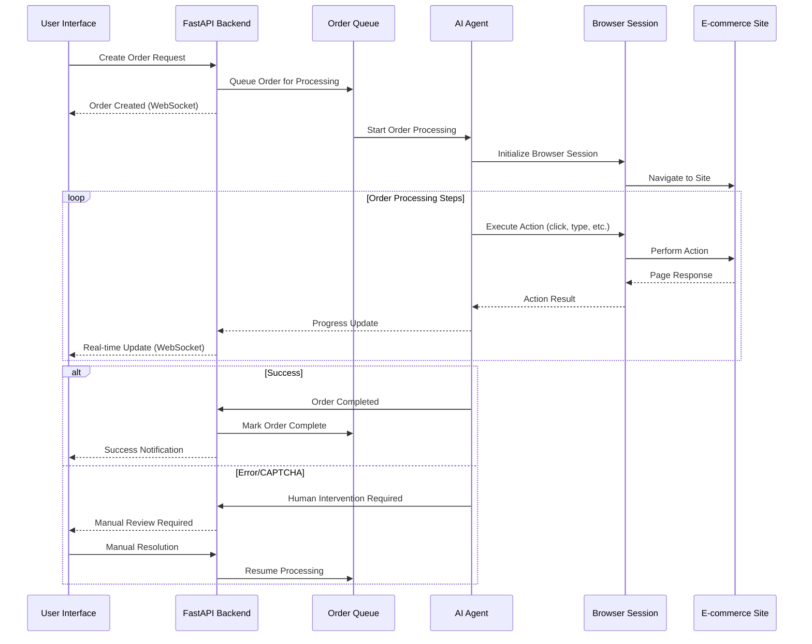

# AI-Powered E-commerce Automation Platform

A modern, scalable platform for automating e-commerce workflows using advanced AI agents and intelligent browser automation.

## Overview

This platform demonstrates how AI agents can automate complex e-commerce tasks with human-in-the-loop capabilities. Built with modern web technologies, it showcases intelligent browser automation, real-time monitoring, and enterprise-grade architecture patterns.

## Key Features

### AI-Powered Automation
- **Multiple AI Agents**: Support for different automation strategies (Strands, Nova Act)
- **Intelligent Decision Making**: AI agents that can handle complex scenarios
- **Natural Language Processing**: Human-like interaction with web interfaces
- **Adaptive Learning**: Agents that improve over time

### Multi-Platform Support
- **Dynamic Configuration**: Easy addition of new e-commerce platforms
- **Flexible URL Management**: Configure starting points for different sites
- **Retailer-Agnostic**: Works with any e-commerce website
- **Scalable Architecture**: Add new platforms without code changes

### Human-in-the-Loop
- **Smart Escalation**: Automatic handoff when human intervention needed
- **Review Dashboard**: Clean interface for manual oversight
- **Error Recovery**: Intelligent retry and fallback mechanisms
- **Real-time Alerts**: Instant notifications for attention-required scenarios

### Production Monitoring
- **Live Dashboard**: Real-time tracking and metrics
- **Queue Management**: Priority-based processing with pause/resume
- **Performance Analytics**: Success rates, timing, and trend analysis
- **Session Monitoring**: Live browser session viewing and control

### Enterprise Architecture
- **Database Flexibility**: SQLite for development, PostgreSQL for production
- **Microservices Ready**: Clean separation of concerns
- **Security First**: Token-based auth and encrypted data handling
- **Full Observability**: Comprehensive logging and metrics

## Architecture



### System Components

#### Frontend Layer
- **React Application**: Modern UI with AWS Cloudscape Design System
- **WebSocket Client**: Real-time updates and live monitoring
- **Order Management**: Create, track, and manage automation orders

#### Backend Layer
- **FastAPI Server**: High-performance async API with automatic documentation
- **Order Queue**: Priority-based processing with concurrent execution
- **Database Layer**: SQLite for development, PostgreSQL for production
- **WebSocket Handler**: Real-time communication with frontend

#### Automation Layer
- **Strands Agent**: LLM-powered browser automation with reasoning capabilities
- **Nova Act Agent**: Natural language browser automation via AWS AgentCore
- **Browser Service**: Unified session management and resource optimization

#### External Services
- **AWS AgentCore**: Secure, scalable browser automation infrastructure
- **E-commerce Sites**: Target platforms for order automation

### Core Components

#### Automation Agents
- **Strands Agent**: Uses Strands SDK with browser tools for intelligent browser control with LLM reasoning
- **Nova Act Agent**: Natural language browser automation with AgentCore integration
- **Browser Service**: Unified browser session lifecycle and resource management

#### Order Queue System
- **Priority Processing**: High, normal, low priority queues
- **Concurrent Execution**: Configurable parallel order processing
- **Retry Logic**: Intelligent error recovery and retry mechanisms
- **Human Escalation**: Automatic handoff for complex scenarios

#### Data Layer
- **Order Management**: Complete order lifecycle tracking
- **Configuration**: Retailer settings and automation parameters
- **Session Tracking**: Browser session state and thumbnails
- **Metrics**: Performance and success rate analytics

## Quick Start

### Prerequisites
- Python 3.11+
- Node.js 18+
- AWS Account (for AgentCore Browser)

### Installation & Setup

1. **Clone and Install**
   ```bash
   git clone <repository-url>
   cd ai-ecommerce-automation
   
   # Install dependencies
   cd backend && pip install -r requirements.txt
   cd ../frontend && npm install
   ```

2. **Configure Environment**
   ```bash
   # Copy environment template
   cp backend/.env.example backend/.env
   
   # Add your configuration
   export AWS_ACCESS_KEY_ID="your-aws-key"
   export AWS_SECRET_ACCESS_KEY="your-aws-secret"
   export AWS_DEFAULT_REGION="us-west-2"
   ```

3. **Start the Platform**
   ```bash
   # Simple one-command start
   ./start.sh
   
   # Access the application
   # Frontend: http://localhost:3000
   # Backend API: http://localhost:8000
   ```

### First Steps
1. **Configure Settings**: Visit Settings to set up AWS region and models
2. **Add Platforms**: Add your e-commerce platforms in Retailer URL Management  
3. **Create Test Order**: Use the Create Order page to test automation
4. **Monitor Progress**: Watch real-time progress in the Dashboard

## Configuration

### Platform Configuration
Configure supported e-commerce platforms through the web interface:

1. **Settings Dashboard**: Navigate to Settings → Retailer URL Management
2. **Add New Platform**: Click "Add URL" and configure:
   - Platform name (e.g., "my-store")
   - Website display name
   - Starting URL for automation
   - Set as default URL (optional)

```javascript
// Example configuration
{
  "retailer": "example-store",
  "website_name": "Example Store Main",
  "starting_url": "https://www.example-store.com",
  "is_default": true
}
```

### Automation Methods
- **Nova Act + AgentCore Browser**: Advanced AI-powered automation (default)
- **Strands + AgentCore Browser + Browser Tools**: Comprehensive automation with full browser control

### Queue Settings
```python
QUEUE_SETTINGS = {
    "max_concurrent_orders": 5,
    "order_timeout_minutes": 30,
    "retry_delay_seconds": 60,
    "max_queue_size": 100
}
```

## API Documentation

### Order Management
- `POST /api/orders` - Create new order
- `GET /api/orders` - List orders with filtering
- `GET /api/orders/{id}` - Get specific order
- `PUT /api/orders/{id}` - Update order (human review)
- `DELETE /api/orders/{id}` - Cancel order

### Queue Management
- `GET /api/queue/metrics` - Get queue statistics
- `POST /api/queue/pause` - Pause order processing
- `POST /api/queue/resume` - Resume order processing

### Configuration
- `GET /api/config/retailers` - Get supported retailers
- `GET /api/config/automation-methods` - Get automation methods
- `PUT /api/config/system` - Update system configuration

### Human Review
- `GET /api/review/queue` - Get orders requiring review
- `POST /api/review/{id}/resolve` - Resolve human review

## Testing

### Backend Tests
```bash
cd backend
pytest tests/ -v
```

### Frontend Tests
```bash
cd frontend
npm test
```

### Integration Tests
```bash
# Run full system tests
python tests/integration/test_order_flow.py
```

## Monitoring & Observability

### Metrics Available
- **Order Success Rate**: Percentage of successfully completed orders
- **Processing Time**: Average time per order completion
- **Queue Depth**: Current pending orders
- **Error Rates**: Failure rates by retailer and method
- **Human Intervention Rate**: Percentage requiring manual review

### Real-time Monitoring
- WebSocket-based live updates
- Browser session thumbnails
- Progress tracking with detailed steps
- Error notifications and alerts

### Logging
- Structured logging with correlation IDs
- Configurable log levels
- Integration with external monitoring systems

## Security

### Data Protection
- Payment information tokenization
- Encrypted sensitive data storage
- Secure API key management
- Session-based authentication

### Network Security
- CORS configuration
- Rate limiting
- Input validation and sanitization
- Secure WebSocket connections

## Deployment

### Local Development
- SQLite database
- File-based configuration
- Local browser sessions

### Production Deployment
- PostgreSQL/RDS database
- Environment-based configuration
- Distributed browser sessions
- Load balancing support

### Docker Deployment
```yaml
version: '3.8'
services:
  backend:
    build: ./backend
    environment:
      - DATABASE_URL=postgresql://user:pass@db:5432/orderdb
    depends_on:
      - db
  
  frontend:
    build: ./frontend
    ports:
      - "3000:3000"
  
  db:
    image: postgres:15
    environment:
      - POSTGRES_DB=orderdb
```

### AWS Deployment
- ECS/Fargate for containerized deployment
- RDS for managed database
- CloudWatch for monitoring
- ALB for load balancing

## Contributing

1. Fork the repository
2. Create a feature branch (`git checkout -b feature/amazing-feature`)
3. Commit your changes (`git commit -m 'Add amazing feature'`)
4. Push to the branch (`git push origin feature/amazing-feature`)
5. Open a Pull Request

### Development Guidelines
- Follow PEP 8 for Python code
- Use ESLint/Prettier for JavaScript
- Write tests for new features
- Update documentation

## License

This project is licensed under the MIT License - see the [LICENSE](LICENSE) file for details.

## Support

### Documentation
- [API Documentation](http://localhost:8000/docs) - Interactive API docs
- [Architecture Guide](docs/architecture.md) - System design details
- [Configuration Reference](docs/configuration.md) - Complete config options

### Getting Help
- Create an issue for bugs or feature requests
- Check existing issues for solutions
- Review the troubleshooting guide

### Troubleshooting

#### Common Issues
1. **Database Connection Errors**
   - Check DATABASE_URL environment variable
   - Ensure database server is running
   - Verify credentials and permissions

2. **Browser Automation Failures**
   - Install Playwright browsers: `playwright install`
   - Check for CAPTCHA requirements
   - Verify retailer website accessibility

3. **WebSocket Connection Issues**
   - Check CORS configuration
   - Verify backend server is running
   - Check firewall settings

#### Performance Optimization
- Adjust `max_concurrent_orders` based on system resources
- Monitor memory usage with multiple browser sessions
- Use headless mode for better performance
- Configure appropriate timeouts

## Technology Stack

### Frontend
- **React 18** with modern hooks and context
- **AWS Cloudscape Design System** for enterprise UI
- **WebSocket** for real-time updates
- **Responsive Design** for all devices

### Backend  
- **FastAPI** for high-performance async API
- **SQLAlchemy** with SQLite/PostgreSQL support
- **WebSocket** for real-time communication
- **Structured Logging** for observability

### AI & Automation
- **AWS Bedrock** for foundation models (Claude, Nova)
- **AgentCore Browser** for secure browser automation
- **Strands SDK** for intelligent browser tools
- **Nova Act** for natural language automation

## Use Cases

This platform demonstrates several key automation patterns:

- **E-commerce Workflow Automation**: End-to-end order processing
- **AI Agent Orchestration**: Multiple agents working together
- **Human-AI Collaboration**: Seamless handoff between AI and humans
- **Real-time Monitoring**: Live tracking of automated processes
- **Error Recovery**: Intelligent handling of edge cases

## Performance & Scalability

- **Concurrent Processing**: Handle multiple orders simultaneously
- **Queue Management**: Priority-based processing with smart scheduling
- **Resource Optimization**: Efficient browser session management
- **Monitoring**: Real-time metrics and performance tracking

## Security & Compliance

- **Data Protection**: Tokenized sensitive information
- **Secure Communication**: HTTPS and WSS protocols
- **Access Control**: Role-based permissions
- **Audit Logging**: Complete activity tracking

---

**A modern demonstration of AI-powered automation with enterprise-grade architecture.**